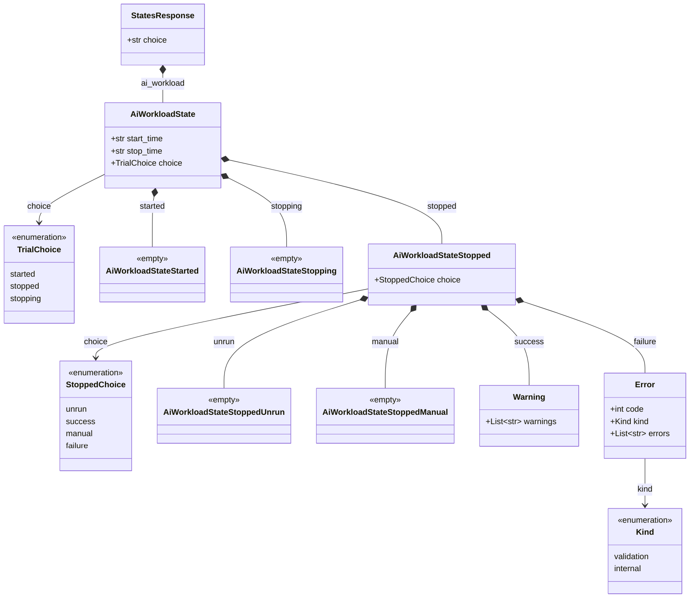

# `get_states(choice=ai_workload)` response structure

This documents the shape of the `/monitor/states` response when
`StatesRequest.choice == "ai_workload"`, as modeled in
[`result/states.yaml`](../result/states.yaml) and
[`result/aiworkload.yaml`](../result/aiworkload.yaml), and generated into the
`snappi` Python SDK as `AiWorkloadState`.

This branch's discriminators are both named `choice` (the standard
openapiart convention for a oneOf-style field), rather than the
`trial_state`/`status` names used previously — the nested shape itself
(`stopped` wrapping `unrun`/`success`/`manual`/`failure`) is unchanged.

## Structure diagram



## Field reference

| Path | Type | Notes |
|---|---|---|
| `ai_workload.start_time` | `str` | ISO 8601 time the run started |
| `ai_workload.stop_time` | `str` | ISO 8601 time the run ended |
| `ai_workload.choice` | `"started" \| "stopped" \| "stopping"` | Discriminator; only the matching sub-object below is populated |
| `ai_workload.started` | empty object | Present only while `choice == "started"` |
| `ai_workload.stopping` | empty object | Present only while `choice == "stopping"` |
| `ai_workload.stopped` | `AiWorkloadStateStopped` | Present only when `choice == "stopped"` |
| `ai_workload.stopped.choice` | `"unrun" \| "success" \| "manual" \| "failure"` | Discriminator for why the run is stopped |
| `ai_workload.stopped.unrun` | empty object | Configuration has never been run |
| `ai_workload.stopped.success` | `Warning` (`.warnings: List[str]`) | Run completed successfully; may still carry non-fatal warnings |
| `ai_workload.stopped.manual` | empty object | Run was stopped manually (e.g. `state=stop`) |
| `ai_workload.stopped.failure` | `Error` (`.code: int`, `.kind: enum`, `.errors: List[str]`) | Run failed |

> **Note:** `stopped.success` and `stopped.failure` resolve to the shared
> `Warning`/`Error` schemas (also used elsewhere in the API for generic
> success/failure payloads), not empty marker objects — this is what lets a
> client read actual warning/error text off a completed run.

## Sample script

Starts the AI workload trial run and blocks until it stops, then reports
warnings on success, errors on failure, or a manual-stop notice. Assumes
`api` is an already-connected `snappi` client with the AI workload
configuration already pushed via `api.set_config(...)`.

```python
import time

import snappi


def run_ai_workload_trial(api, poll_interval_s=2.0):
    """Start the configured AI workload trial and wait for it to finish."""
    control_state = api.control_state()
    trial = control_state.ai_workload.ai_workload_trial
    trial.state = trial.START
    api.set_control_state(control_state)

    states_request = api.states_request()
    states_request.ai_workload  # selects the ai_workload choice

    while True:
        ai_state = api.get_states(states_request).ai_workload
        if ai_state.choice != ai_state.STOPPED:
            time.sleep(poll_interval_s)
            continue

        stopped = ai_state.stopped
        if stopped.choice == stopped.SUCCESS:
            warnings = stopped.success.warnings or []
            print("Trial succeeded with {} warning(s):".format(len(warnings)))
            for warning in warnings:
                print("  - {}".format(warning))
        elif stopped.choice == stopped.FAILURE:
            error = stopped.failure
            print("Trial failed (code={}, kind={}):".format(error.code, error.kind))
            for message in error.errors:
                print("  - {}".format(message))
        elif stopped.choice == stopped.MANUAL:
            print("Trial was stopped manually.")
        else:
            print("Trial stopped with unexpected reason: {}".format(stopped.choice))
        break


if __name__ == "__main__":
    api = snappi.api(location="https://localhost:8443", transport="https")
    run_ai_workload_trial(api)
```
