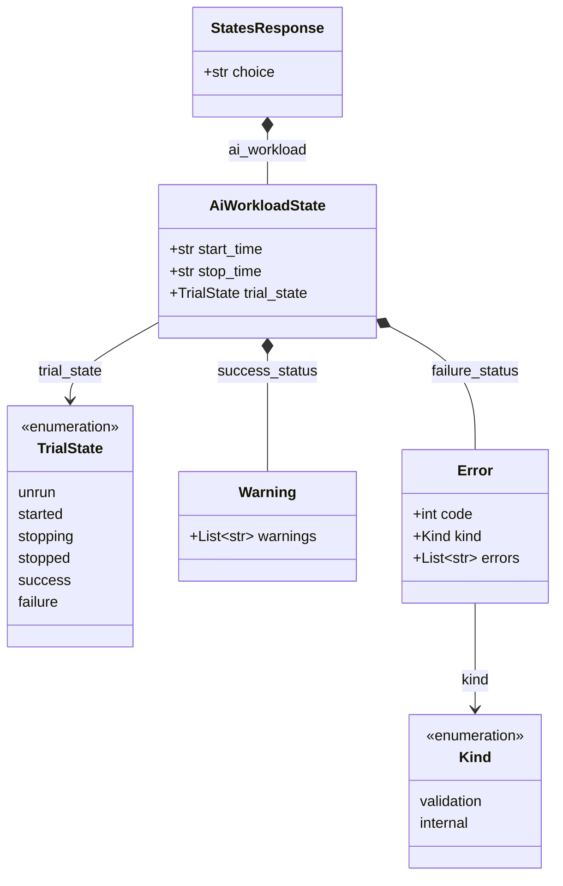

# `get_states(choice=ai_workload)` response structure

This documents the shape of the `/monitor/states` response when
`StatesRequest.choice == "ai_workload"`, as modeled in
[`result/states.yaml`](../result/states.yaml) and
[`result/aiworkload.yaml`](../result/aiworkload.yaml), and generated into the
`snappi` Python SDK as `AiWorkloadState`.

This branch uses a flat status design: `trial_state` is a single
discriminator covering every lifecycle state (including terminal
success/failure), with `success_status`/`failure_status` as flat sibling
fields rather than nested per-outcome sub-objects.

## Structure diagram



## Field reference

| Path | Type | Notes |
|---|---|---|
| `ai_workload.start_time` | `str` | ISO 8601 time the run started |
| `ai_workload.stop_time` | `str` | ISO 8601 time the run ended |
| `ai_workload.trial_state` | `"unrun" \| "started" \| "stopping" \| "stopped" \| "success" \| "failure"` | Single discriminator covering the whole lifecycle, including both terminal outcomes |
| `ai_workload.success_status` | `Warning` (`.warnings: List[str]`) | Populated when `trial_state == "success"`; carries any non-fatal warnings |
| `ai_workload.failure_status` | `Error` (`.code: int`, `.kind: enum`, `.errors: List[str]`) | Populated when `trial_state == "failure"` |

> **Note:** unlike the nested/discriminated-union designs on other branches,
> there is no intermediate `stopped` wrapper — `trial_state` itself carries
> the terminal outcome (`success`/`failure`) alongside the transient states
> (`unrun`/`started`/`stopping`/`stopped`). `success_status`/`failure_status`
> resolve to the shared `Warning`/`Error` schemas, so a client can read
> actual warning/error text directly once `trial_state` settles.

## Sample script

Starts the AI workload trial run and blocks until it reaches a terminal
state, then reports warnings on success, errors on failure, or a
manual-stop notice. Assumes `api` is an already-connected `snappi` client
with the AI workload configuration already pushed via `api.set_config(...)`.

```python
import time

import snappi


def run_ai_workload_trial(api, poll_interval_s=2.0):
    """Start the configured AI workload trial and wait for it to finish."""
    control_state = api.control_state()
    trial = control_state.ai_workload.ai_workload_trial
    trial.state = trial.START
    api.set_control_state(control_state)

    states_request = api.states_request()
    states_request.ai_workload  # selects the ai_workload choice

    while True:
        ai_state = api.get_states(states_request).ai_workload
        trial_state = ai_state.trial_state
        if trial_state in (ai_state.UNRUN, ai_state.STARTED, ai_state.STOPPING):
            time.sleep(poll_interval_s)
            continue

        if trial_state == ai_state.SUCCESS:
            warnings = ai_state.success_status.warnings or []
            print("Trial succeeded with {} warning(s):".format(len(warnings)))
            for warning in warnings:
                print("  - {}".format(warning))
        elif trial_state == ai_state.FAILURE:
            error = ai_state.failure_status
            print("Trial failed (code={}, kind={}):".format(error.code, error.kind))
            for message in error.errors:
                print("  - {}".format(message))
        elif trial_state == ai_state.STOPPED:
            print("Trial was stopped manually.")
        else:
            print("Trial stopped with unexpected trial_state: {}".format(trial_state))
        break


if __name__ == "__main__":
    api = snappi.api(location="https://localhost:8443", transport="https")
    run_ai_workload_trial(api)
```
